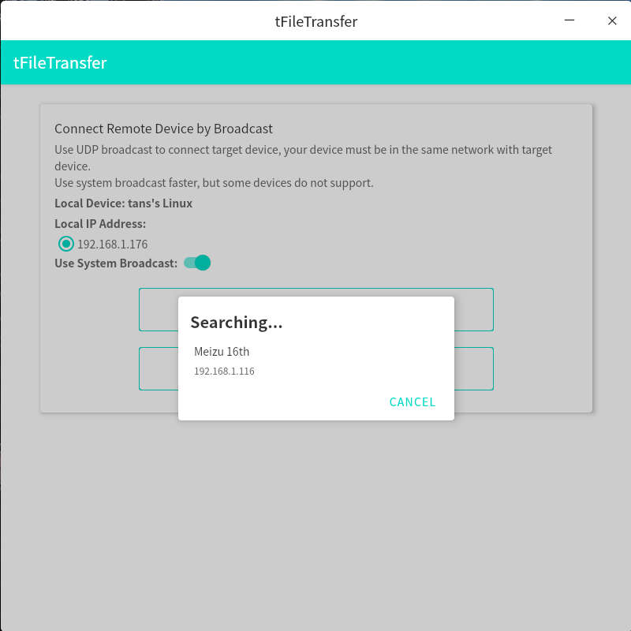

[English](./README.md)

## 简单介绍
使用 [Compose for Desktop](https://github.com/JetBrains/compose-multiplatform) 构建的桌面版文件传输工具，通过本地局域网创建连接来发送/接收文件。目前支持 Window， Linux 和 MacOS。  

创建文件传输链接的方法：  
- 二维码建立连接（限制本地局域网，只能展示二维码，Android 版支持扫描） 
- UDP 广播创建连接 （限制本地局域网） 

[Android 版](https://github.com/Tans5/tFileTransporter)  

## 截图
   

   

   