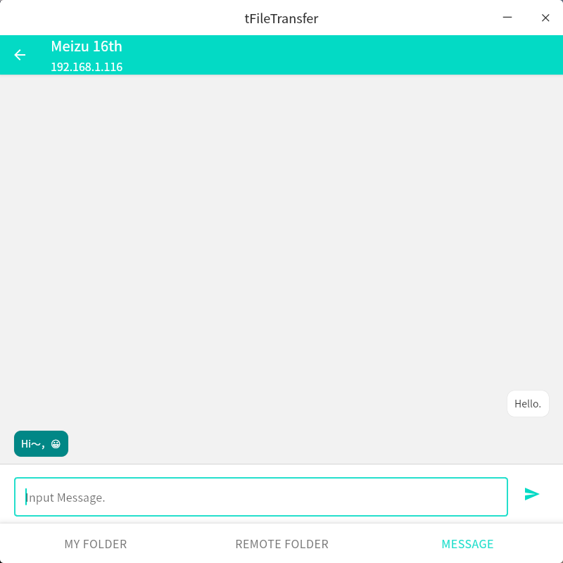
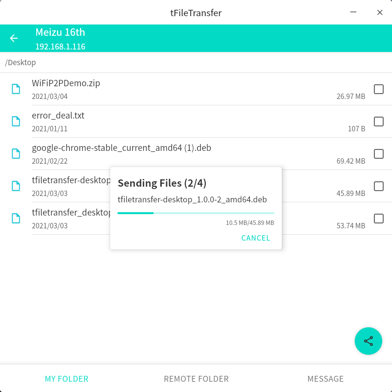

## Summary
File transfer tools built with Compose Desktop. It could transfer files to device that in the same network.  
[Android Version](https://github.com/Tans5/tFileTransporter)

## Screenshots
   

   

   
