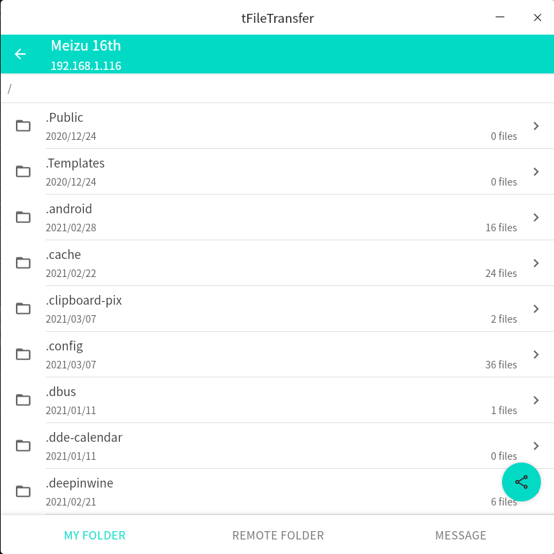
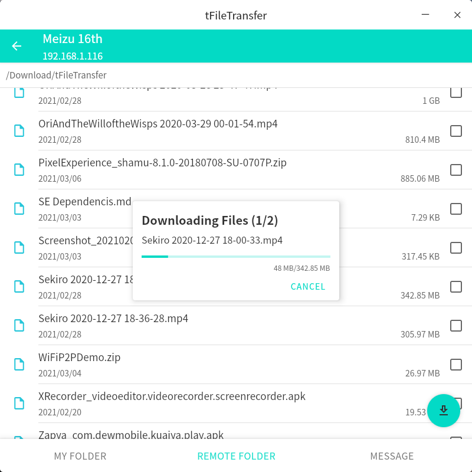

## Summary
File transfer tools built with Compose Desktop. It could transfer files to device that in the same network.  
[Android Version](https://github.com/Tans5/tFileTransporter)

#### Packages
- [Windows 10](packages/windows_tfiletransfer.rar) (Windows Version need Jre 15 or above)
- [MAC OS X](packages/macosx_tFileTransfer_desktop-1.0.0.dmg)
- [Linux RPM](packages/linux_tfiletransfer_desktop-1.0.0-1.x86_64.rpm)
- [Linux DEB](packages/linux_tfiletransfer-desktop_1.0.0-2_amd64.deb)

## Screenshots
   

   

   
